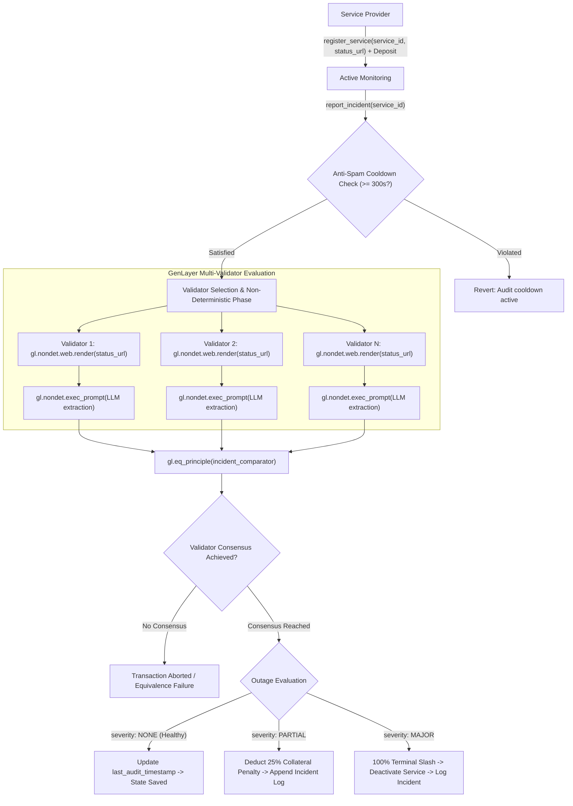

# Autonomous Incident Oracle (`AutonomousIncidentOracle`)

[](https://genlayer.com)
[](https://github.com/genlayerlabs/genvm-manager)
[]()
[](LICENSE)

An intelligent, autonomous Web3 SLA monitoring and outage verification oracle deployed on **GenLayer**. Powered by decentralized multi-validator consensus, non-deterministic live web rendering, LLM extraction, and a custom multi-tier equivalence comparator (`incident_comparator`).

- **Studionet Contract Address**: [`0x9dF3C49Db61aC1E87eB421385ac515c2FBF0855a`](https://studio.genlayer.com)
- **Pinned GenVM Runner**: `py-genlayer:1jb45aa8ynh2a9c9xn3b7qqh8sm5q93hwfp7jqmwsfhh8jpz09h6`

---

## 1. Executive Summary & Problem Statement

### The Problem with Traditional SLA & Uptime Verification
Decentralized physical infrastructure networks (DePIN), RPC providers, cross-chain bridges, decentralized storage networks, and escrow protocols depend critically on infrastructure availability guarantees. However, traditional blockchain architectures cannot natively inspect real-world web status:
- **Centralized Cron Keepers**: Conventional protocols rely on centralized keepers (e.g., Gelato, Chainlink Keepers, centralized AWS Lambda crons) that introduce censorship risks, single points of failure, and trust assumptions.
- **Vulnerable Off-Chain Relayers**: Off-chain bots feeding signed web results or HTTP ping responses to deterministic smart contracts are susceptible to man-in-the-middle exploits, compromised signing keys, and spoofed responses.
- **Binary & Fragile Assertions**: Status pages and incident feeds frequently change HTML layouts, employ CDN caching layers with non-deterministic timestamps, or output semi-structured incident announcements that deterministic EVM opcodes cannot evaluate.

### The GenLayer Solution
`AutonomousIncidentOracle` transforms Web3 SLA enforcement into an autonomous, decentralized primitive:
1. **Decentralized Multi-Validator Execution**: Multiple independent GenLayer validators independently execute non-deterministic HTTP rendering (`gl.nondet.web.render`) and LLM reasoning (`gl.nondet.exec_prompt`) directly against live service status pages.
2. **Deterministic Consensus via Equivalence Principle**: Rather than requiring byte-for-byte string identity, validators achieve consensus via `gl.eq_principle` with our mathematically bounded multi-tier comparator (`incident_comparator`).
3. **Trustless Economic Collateral & Slashing**: Service providers deposit collateral upfront. The contract automatically assesses partial penalties (25% slashing) or complete terminal deactivations (100% slash) when confirmed outages violate agreed SLA standards—with zero off-chain human intermediaries.

---

## 2. Consensus Architecture & Lifecycle

### End-to-End State Transition Lifecycle



### Multi-Validator Web Fetching & LLM Ingestion
When `report_incident` is executed:
1. Each validator independently invokes `gl.nondet.web.render(status_url)`. This renders the target page (resolving JavaScript where applicable) and returns the DOM or response payload.
2. If network timeouts, HTTP 5xx, or DNS failures occur, the call enters a graceful degradation branch, flagging `FETCH_ERROR: <reason>`.
3. The rendered payload is packaged into a structured system prompt instructing the GenVM LLM runtime to evaluate outage indicators and return a strict JSON schema:
   ```json
   {
     "is_outage": true,
     "severity": "MAJOR",
     "timestamp_epoch": 1710000000,
     "reason": "Core database cluster unreachable"
   }
   ```
4. Output formatting artifacts (e.g. markdown backticks ` ```json `) are sanitized before passing to consensus.

---

## 3. Equivalence Principle Deep-Dive (`incident_comparator`)

In distributed consensus with AI and web data, no two validators will obtain byte-identical strings due to:
- CDN cache distribution and differing proxy edge server response times.
- Minor token generation divergence across LLM instances.
- Natural timestamp drift between validator evaluation triggers.

A naive `a == b` string equality check causes 100% consensus failures. GenLayer solves this through `gl.eq_principle`, which takes an equivalence comparator:

```python
def incident_comparator(res_a: str, res_b: str) -> bool:
```

### Multi-Tier Equivalence Matrix

| Evaluation Field | Consensus Requirement | Justification |
| :--- | :--- | :--- |
| **`is_outage`** | **Strict Boolean Parity** (`bool(a) == bool(b)`) | Fundamental binary condition. No ambiguity is permitted between healthy and degraded states. |
| **`severity`** | **Strict Categorical Match** (`"NONE"`, `"PARTIAL"`, `"MAJOR"`) | Case-insensitive match on exact enum values. Mismatched classifications reject consensus. |
| **`timestamp_epoch`** | **Bounded Temporal Window** ($\Delta \le 900\text{s}$) | $\pm 15$-minute tolerance window absorbs CDN propagation delays, cache expirations, and validator scheduling skews while rejecting stale data. |
| **`reason`** | **Contextual / Informational** | Informational explanation; does not block consensus as long as outage, severity, and temporal validity agree. |

### Edge-Case Hardening
`incident_comparator` is battle-tested against:
- Malformed JSON, non-JSON strings, and empty/whitespace-only payloads (safely returns `False`).
- Unicode invisible characters and non-standard spacing (`\u200b`, `\u3000`, `\xa0`).
- Non-integer, non-finite (`NaN`, `+Inf`, `-Inf`), or out-of-range timestamps ($> 10^{14}$ or $< 0$).
- Subversive payloads containing JSON primitives or arrays instead of valid dictionary mappings.

---

## 4. Hardened Security & Anti-DoS Design

### 1. Anti-Spam Cooldown (`MIN_AUDIT_INTERVAL = 300`)
Non-deterministic web rendering and LLM prompt execution impose computational and financial costs on validators. 
- A mandatory 300-second (5-minute) per-service cooldown window is enforced on `report_incident`.
- Calling `report_incident` within the cooldown period immediately reverts with an explicit error detailing the remaining seconds, preventing spam attacks and redundant validator load.

### 2. Graceful Degradation on Web & LLM Failures
- **Web Fetch Resilience**: If `gl.nondet.web.render` raises connection timeouts or HTTP errors, the failure is caught and formatted as `FETCH_ERROR: <reason>`, enabling the LLM to inspect the downtime failure context.
- **LLM Fallback Resilience**: If LLM execution fails unexpectedly, an internal fallback payload synthesizes an incident record based on the fetch error state, ensuring validator processes do not panic or halt consensus.

### 3. Economic Security & Timelocked Collateral
- **100% Terminal Slashing**: `severity == "MAJOR"` results in total deposit forfeiture (`deposit = 0`) and permanent service deactivation (`is_slashed = True`). Slashed services cannot be audited further or withdrawn.
- **25% Partial Slashing**: `severity == "PARTIAL"` deducts 25% (`PARTIAL_SLASH_PENALTY_PCT`) of the active deposit. When collateral reaches 0, the service is marked slashed.
- **Top-Up Mechanism**: Service providers can top up their deposit at any time via `top_up_deposit`.
- **24-Hour Dispute Timelock (`WITHDRAWAL_LOCK_PERIOD = 86400`)**: Providers cannot withdraw collateral within 24 hours of service registration or within 24 hours of any logged incident, preventing rug-pulls during active dispute or outage investigations.

### 4. WASI Storage Persistence
All state mutations explicitly update GenVM's persistent storage descriptors (`services: TreeMap[str, str]`, `incident_logs: TreeMap[str, DynArray[str]]`) through serialized records, guaranteeing storage persistence across WASI host boundaries.

---

## 5. API Reference & Contract Interfaces

### Write Methods

#### `register_service(service_id: str, status_url: str) -> None`
- **Modifiers**: `@gl.public.write.payable`
- **Permissions**: Public (anyone can register a service; requires non-negative deposit via `gl.message.value`).
- **Validation**:
  - `service_id`: Non-empty string.
  - `status_url`: Must start with `https://`.
  - Service must not have been previously registered.

#### `report_incident(service_id: str) -> str`
- **Modifiers**: `@gl.public.write`
- **Permissions**: Public (permissionless auditing).
- **Validation**:
  - Service must exist and not be slashed.
  - Must satisfy `MIN_AUDIT_INTERVAL` (300s) cooldown since last audit.
- **Returns**: JSON string of confirmed consensus incident evaluation.

#### `top_up_deposit(service_id: str) -> int`
- **Modifiers**: `@gl.public.write.payable`
- **Permissions**: Public (requires `gl.message.value > 0`).
- **Validation**: Service must exist.
- **Returns**: Updated deposit balance.

#### `withdraw_deposit(service_id: str, amount: int) -> int`
- **Modifiers**: `@gl.public.write`
- **Permissions**: Service registrant or contract owner.
- **Validation**:
  - Service must not be slashed.
  - `amount > 0` and `amount <= current_deposit`.
  - Service must be incident-free for $\ge 86,400\text{s}$ (24 hours).
- **Returns**: Remaining deposit balance.

---

### View Methods

#### `get_service(service_id: str) -> dict`
- **Modifiers**: `@gl.public.view`
- **Returns**: Metadata dictionary:
  ```json
  {
    "status_url": "https://status.rpc-node.com",
    "deposit": 1000000000000000000,
    "is_slashed": false,
    "total_incidents": 0,
    "registered_by": "0xe4220c4b...",
    "last_audit_timestamp": 1710000300,
    "last_incident_timestamp": 0,
    "created_at": 1710000000
  }
  ```

#### `get_incidents(service_id: str) -> list[dict]`
- **Modifiers**: `@gl.public.view`
- **Returns**: Historical array of all consensus-confirmed incident records.

---

## 6. Verification & Test Suite Matrix

The oracle is backed by a test suite covering all comparator boundary conditions, malicious payloads, and state transitions.

```text
============================= test session starts =============================
platform win32 -- Python 3.12.10, pytest-9.1.1, pluggy-1.6.0
rootdir: incident-oracle
plugins: anyio-4.14.0, genlayer-test-0.30.0rc2
collected 36 items

tests/test_oracle.py::TestIncidentComparatorIdenticalInputs::test_identical_major_outage PASSED [  2%]
tests/test_oracle.py::TestIncidentComparatorIdenticalInputs::test_identical_no_outage PASSED [  5%]
tests/test_oracle.py::TestIncidentComparatorIdenticalInputs::test_identical_partial_outage PASSED [  8%]
tests/test_oracle.py::TestIncidentComparatorIdenticalInputs::test_identical_keys_different_ordering_and_whitespace PASSED [ 11%]
tests/test_oracle.py::TestIncidentComparatorTimestampWindow::test_timestamp_delta_within_window PASSED [ 13%]
tests/test_oracle.py::TestIncidentComparatorTimestampWindow::test_timestamp_exact_boundary_positive_900s PASSED [ 16%]
tests/test_oracle.py::TestIncidentComparatorTimestampWindow::test_timestamp_exact_boundary_negative_900s PASSED [ 19%]
tests/test_oracle.py::TestIncidentComparatorTimestampWindow::test_timestamp_899s_delta PASSED [ 22%]
tests/test_oracle.py::TestIncidentComparatorDivergentSeverity::test_major_vs_partial PASSED [ 25%]
tests/test_oracle.py::TestIncidentComparatorDivergentSeverity::test_major_vs_none PASSED [ 27%]
tests/test_oracle.py::TestIncidentComparatorDivergentSeverity::test_case_insensitive_severity_matches PASSED [ 30%]
tests/test_oracle.py::TestIncidentComparatorDivergentSeverity::test_invalid_severity_string PASSED [ 33%]
tests/test_oracle.py::TestIncidentComparatorTimestampDivergence::test_timestamp_delta_901s PASSED [ 36%]
tests/test_oracle.py::TestIncidentComparatorTimestampDivergence::test_timestamp_negative_delta_901s PASSED [ 38%]
tests/test_oracle.py::TestIncidentComparatorTimestampDivergence::test_large_timestamp_delta PASSED [ 41%]
tests/test_oracle.py::TestIncidentComparatorInvalidJSONAndHardening::test_malformed_json_syntax PASSED [ 44%]
tests/test_oracle.py::TestIncidentComparatorInvalidJSONAndHardening::test_non_json_string PASSED [ 47%]
tests/test_oracle.py::TestIncidentComparatorInvalidJSONAndHardening::test_unicode_whitespace_handling PASSED [ 50%]
tests/test_oracle.py::TestIncidentComparatorInvalidJSONAndHardening::test_non_string_types PASSED [ 52%]
tests/test_oracle.py::TestIncidentComparatorInvalidJSONAndHardening::test_json_primitive_or_array_instead_of_object PASSED [ 55%]
tests/test_oracle.py::TestIncidentComparatorInvalidJSONAndHardening::test_missing_required_keys PASSED [ 58%]
tests/test_oracle.py::TestIncidentComparatorInvalidJSONAndHardening::test_is_outage_type_and_parity PASSED [ 61%]
tests/test_oracle.py::TestIncidentComparatorInvalidJSONAndHardening::test_extreme_and_invalid_timestamps PASSED [ 63%]
tests/test_oracle.py::TestIncidentComparatorInvalidJSONAndHardening::test_non_string_severity PASSED [ 66%]
tests/test_oracle.py::TestAutonomousIncidentOracleContract::test_contract_initialization PASSED [ 69%]
tests/test_oracle.py::TestAutonomousIncidentOracleContract::test_register_service_success PASSED [ 72%]
tests/test_oracle.py::TestAutonomousIncidentOracleContract::test_register_service_validation PASSED [ 75%]
tests/test_oracle.py::TestAutonomousIncidentOracleContract::test_get_service_not_found PASSED [ 77%]
tests/test_oracle.py::TestAutonomousIncidentOracleContract::test_get_incidents_not_found PASSED [ 80%]
tests/test_oracle.py::TestAutonomousIncidentOracleContract::test_report_incident_validation PASSED [ 83%]
tests/test_oracle.py::TestAutonomousIncidentOracleContract::test_report_incident_anti_spam_cooldown PASSED [ 86%]
tests/test_oracle.py::TestAutonomousIncidentOracleContract::test_report_incident_web_failure_graceful_degradation PASSED [ 88%]
tests/test_oracle.py::TestAutonomousIncidentOracleContract::test_report_incident_llm_failure_graceful_degradation PASSED [ 91%]
tests/test_oracle.py::TestAutonomousIncidentOracleContract::test_report_incident_partial_outage_deducts_penalty PASSED [ 94%]
tests/test_oracle.py::TestAutonomousIncidentOracleContract::test_deposit_top_up_and_recovery PASSED [ 97%]
tests/test_oracle.py::TestAutonomousIncidentOracleContract::test_deposit_withdrawal_lock_period PASSED [100%]

============================= 36 passed in 0.38s ==============================
```

### GenVM Static Analysis & Linter Verification
Verified using the official GenVM AST linter:
```bash
python -m genvm_linter.cli check contracts/autonomous_incident_oracle.py --json
```
Output:
```json
{
  "ok": true,
  "lint": { "ok": true, "passed": 2 },
  "validate": {
    "ok": true,
    "contract": "AutonomousIncidentOracle",
    "methods": 6,
    "view_methods": 2,
    "write_methods": 4,
    "ctor_params": 0
  }
}
```

---

## 7. Getting Started & Development

### Prerequisites
- Python 3.11 or 3.12
- Node.js $\ge 18$ (for GenLayer CLI and Studio)

### Installation
```bash
# Clone the repository
git clone https://github.com/JimmyOgb/incidentoracle.git
cd incidentoracle

# Set up virtual environment
python -m venv .venv
source .venv/bin/activate  # On Windows: .venv\Scripts\activate

# Install dependencies
pip install -e .
```

### Running the Test Suite
```bash
pytest tests/test_oracle.py -v
```

### Running the GenVM Linter
```bash
python -m genvm_linter.cli check contracts/autonomous_incident_oracle.py
```

---

## 8. License

This project is licensed under the [MIT License](LICENSE).
